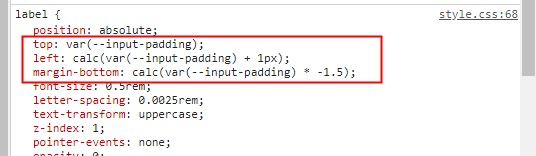
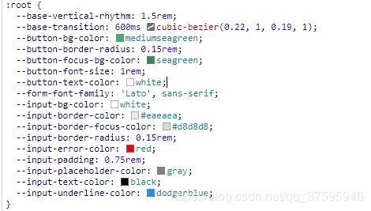

目录： 
### [1.vue-cli3.0 使用postcss-plugin-px2rem（推荐）和 postcss-pxtorem（postcss-px2rem）自动转换px为rem 的配置方法](#title1)

### [2. 移动端适配方案](#title2)

### [3. CSS3中的 “var()” 和 “:root”](#title3)


---
---
---


<h2 id="title1">vue-cli3.0 使用postcss-plugin-px2rem（推荐）和 postcss-pxtorem（postcss-px2rem）自动转换px为rem 的配置方法；</h2>

<a href="https://www.cnblogs.com/taohuaya/p/10274993.html" target="_blank">原文链接</a>


## 如何在vue-cli3.0中使用postcss-plugin-px2rem 插件

插件的作用是 自动将vue项目中的px转换为rem 。

为什么这三个中要推荐  postcss-plugin-px2rem呢？

因为 postcss-plugin-px2rem 这个插件  配置选项上有  exclude 属性，它可以配置 是否对 某个文件夹下的所有css文件不进行从px到rem的转换。

　　所以我们可以利用这个特性，把项目中的  node_module 文件夹排除掉。这样如果我们项目中是用了，前端UI框架的话，就不会吧UI框架（Vant,Element等）中的 px单位转换成rem了

postcss-plugin-px2rem官方文档：https://www.npmjs.com/package/postcss-plugin-px2rem

postcss-pxtorem官方文档：https://www.npmjs.com/package/postcss-pxtorem

postcss-px2rem官方文档：https://www.npmjs.com/package/postcss-px2rem

使用时分别npm对应的插件：
```js
npm i postcss-plugin-px2rem  --save -dev

or

npm i postcss-pxtorem  --save -dev

or

npm i postcss-loader --save-dev
```

具体配置方法如下：

在vue-cli3.0中。去掉了build和config文件夹。所有的配置都放到了vue.config.js中（默认为空，如果没有这个文件自己写一个）。
先上代码，vue.config.js的配置如下

```js
module.exports = {
    //反向代理的配置
    devServer: {
        proxy: {
            '/api': {
                target: 'http://m.maoyan.com',//目标地址
                ws: true, //// 是否启用websockets
                changeOrigin: true, //开启代理：在本地会创建一个虚拟服务端，然后发送请求的数据，并同时接收请求的数据，这样服务端和服务端进行数据的交互就不会有跨域问题
                pathRewrite: {'^/api': '/'}    //这里重写路径
            }

        }
    },
    //px转rem的配置（postcss-plugin-px2rem插件）
    lintOnSave: true,
    css: {
        loaderOptions: {
            postcss: {
                plugins: [
                    require('postcss-plugin-px2rem')({
                        // rootValue: 100, //换算基数， 默认100  ，这样的话把根标签的字体规定为1rem为50px,这样就可以从设计稿上量出多少个px直接在代码中写多上px了。
                        // unitPrecision: 5, //允许REM单位增长到的十进制数字。
                        //propWhiteList: [],  //默认值是一个空数组，这意味着禁用白名单并启用所有属性。
                        // propBlackList: [], //黑名单
                        exclude: /(node_module)/,  //默认false，可以（reg）利用正则表达式排除某些文件夹的方法，例如/(node_module)/ 。如果想把前端UI框架内的px也转换成rem，请把此属性设为默认值
                        // selectorBlackList: [], //要忽略并保留为px的选择器
                        // ignoreIdentifier: false,  //（boolean/string）忽略单个属性的方法，启用ignoreidentifier后，replace将自动设置为true。
                        // replace: true, // （布尔值）替换包含REM的规则，而不是添加回退。
                        mediaQuery: false,  //（布尔值）允许在媒体查询中转换px。
                        minPixelValue: 3 //设置要替换的最小像素值(3px会被转rem)。 默认 0
                    }),
                ]
            }
        }
    },


}
```

上面反向代理的配置请忽略（与本例无关）。

如何把html表情的1rem规定为50px呢，请移步这个链接：https://github.com/Ta0hua/myCssRem

 

在vue-cli3中使用postcss-pxtorem和 postcss-px2rem 配置类似，如下：

使用postcss-pxtorem 时vue.config.js配置：

```js
module.exports = {
    lintOnSave: true,
    css: {
        loaderOptions: {
            postcss: {
                plugins: [
                    require('postcss-pxtorem')({//这里是配置项，详见官方文档
                        rootValue : 1, // 换算的基数
                        selectorBlackList  : ['weui','mu'], // 忽略转换正则匹配项
                        propList   : ['*'],
                    }),
                ]
            }
        }
    },
}
```

使用postcss-px2rem时的vue.config.js配置：

```js
module.exports = {
    lintOnSave: true,
    css: {
        loaderOptions: {
            postcss: {
                plugins: [
                    require('postcss-px2rem')({ //配置项，详见官方文档
                        remUnit: 30
                    }), // 换算的基数
                ]
            }
        }
    },
}
```

### 记得npm i 安装包；

## 可能遇到的坑：

　　如果个别地方不想转化px。可以简单的使用大写的 PX 或 Px 。

---
---
---

<h2 id="title2">移动端适配方案<h2>

### 以上内容 ： 插件的作用是 自动将vue项目中的px转换为rem
### 在postcss runtime 是，把遇到的px 按照配置规则转换为rem， 省去了在开发中css 单位用rem


屏幕自适应的原理是 修改根字体大小

## 方法一

js 修改根字体大小（方法很多）

例如：

```js
(function () {
  const resetFontSize = () => {
    const bodyWidth = document.body.clientWidth
    const fontSize = bodyWidth >= 750 ? 100 : 100 * bodyWidth / 375
    document.documentElement.style.fontSize = fontSize + 'px'
  }
  resetFontSize()
  window.addEventListener('load', () => {
    resetFontSize()
    window.timeOnPageStart = new Date()
  }, false)
  window.addEventListener('orientationchange', resetFontSize, false)
  window.addEventListener('resize', resetFontSize, false)
})()

or

(function() {
	function w() {
		var r = document.documentElement;
		var a = r.getBoundingClientRect().width;
		a > 750 && (a = 750), rem = a / (7.5), r.style.fontSize = rem + "px"
	}
	var t;
	w(), window.addEventListener("resize", function() {
		t && clearTimeout(t), t = setTimeout(w, 300)
	}, false)
})();


```

## 方法二

通过css 配合媒体查询设置根字体
```css

html {
/* 根字体 1rm == 100px */
  font-size: 625%; 
}

@media screen and (max-width: 500px) {
  html {
    /* 根字体 1rm == 10px */
    font-size: 62.5%;
  }
}

or

:root {
/* 根字体 1rm == 100px */
  font-size: 625%; 
}

@media screen and (max-width: 500px) {
  :root {
    /* 根字体 1rm == 10px */
    font-size: 62.5%;
  }
}

```

---
---
---

<h2 id="title3">CSS3中的 “var()” 和 “:root”<h2>

#### <a href="https://blog.csdn.net/qq_37595946/article/details/84531311" target="_blank">原文链接</a>



原来这些仅仅是自定义的css属性，在需要的时候可以使用var()函数引用
关于var()函数的作用和使用方法，参考：[MDN](https://developer.mozilla.org/zh-CN/docs/Web/CSS/:root)

var()
var()函数可以代替元素中任何属性中的值的任何部分。var()函数不能作为属性名、选择器或者其他除了属性值之外的值。（这样做通常会产生无效的语法或者一个没有关联到变量的值。）

:root
:root是一个伪类，表示文档根元素，非IE及ie8及以上浏览器都支持，在:root中声明相当于全局属性，只要当前页面引用了:root segment所在文件，都可以使用var()来引用

eg:

```css

:root {
  --main-bg-color: pink;
}

body {
  background-color: var(--main-bg-color);
}

```

